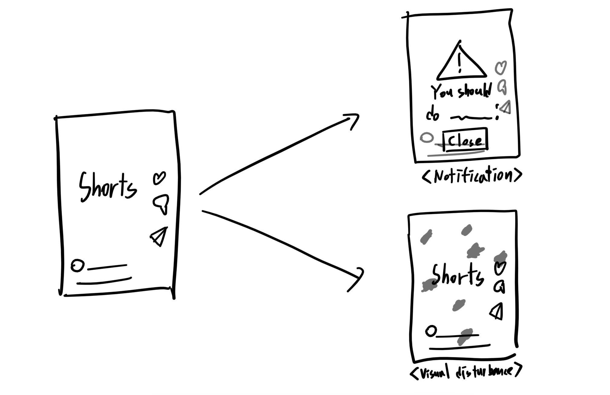

# Pitch

<!-- Under 500 words. -->

## Problem

숏폼 영상을 시간 가는 줄 모르고 보고 있다가 해야 할 일을 하는 데에 방해를 받은 적이 많습니다. 

## Who else?

주변에서도 숏폼 영상으로 인해 일을 제때 끝내지 못하거나, 집중력이 숏폼을 자주 시청하기 이전보다 낮아졌다는 말을 하는 사람들이 많습니다.

## Existing solutions

현재 있는 시간 제한 앱들은 일정 시간이 되면 즉시 앱의 사용을 차단합니다. 하지만 이렇게 갑자기 사용이 차단당하면, 사람들은 제한을 풀어버리고 계속 보거나 보상 심리로 휴대폰이 아닌 다른 딴짓을 하는 등 생산성에 크게 도움을 주지 못하는 경우가 많습니다.

## Solution

하루 사용 시간 설정 -> 사용 시간이 초과되면 '다른 앱 위에 그리기' 활용해 화면에 시각적 방해(흑백, 검은 점, 노이즈 등)을 점진적으로 추가 or 캘린더와 연동하여 할 일을 지속적인 알림으로 띄움

## No-gos

- Android only
- Youtube and Instagram only
- No login
- Two modes(visual, notification)
